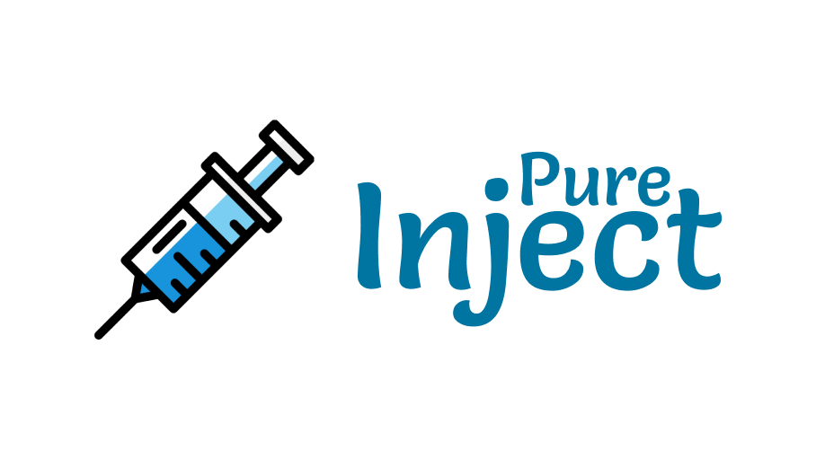

# pureinject

A light, pure javascript, dependency free injection "framework" for javascript projects.




## Setup

Just add to your dependencies using NPM or Yarn:

```
npm install pureinject
```

or

```
yarn add pureinject
```

## How to use

```js
const { createInjector } = require('pureinject');

class MyHttpService {
  // ...
}

class MyService {
  constructor(injector) {
    this._httpService = injector.resolve('MyHttpService');
  }
}

const injector = createInjector();

injector.register('MyHttpService', injector => {
  return new MyHttpService();
});

injector.register('MyService', injector => {
  return MyService(injector);
});
```

### With Typescript

```ts
import { createInjector, PureInjector } from 'pureinject'

class MyHttpService {
  // ...
}

class MyService {

  private _httpService: MyHttpService

  constructor(injector: PureInjector) {
    this._httpService = injector.resolve<MyHttpService>('MyHttpService');
  }
}

const injector: PureInjector = createInjector()

injector.register('MyHttpService', (injector: PureInjector) => {
  return new MyHttpService();
})

injector.register('MyService', (injector: PureInjector) => {
  return MyService(injector);
});
```

## How it works

It's simple: each time you call `injector.resolve`, it will run the the registered function and will retrieve the new instance of the service.

You can return what you want inside a registered module.

If you want to resolve a string value, you can!

```js
const { createInjector } = require('pureinject');

class HttpService {
  constructor(injector) {
    this._apiUrl = injector.resolve('API_URL');
  }
}

const injector = createInjector();

injector.register('API_URL', injector => {
  return 'https://api.site.com';
});

injector.register('HttpService', injector => {
  return new HttpService(injector);
});
```

## About

- [CHANGELOG](CHANGELOG.md)
- [Express app sample](https://github.com/benhurott/pureinject-express-sample)

## Thanks to

<div>Icons made by <a href="https://www.freepik.com/" title="Freepik">Freepik</a> from <a href="https://www.flaticon.com/" 			    title="Flaticon">www.flaticon.com</a> is licensed by <a href="http://creativecommons.org/licenses/by/3.0/" 			    title="Creative Commons BY 3.0" target="_blank">CC 3.0 BY</a></div>
